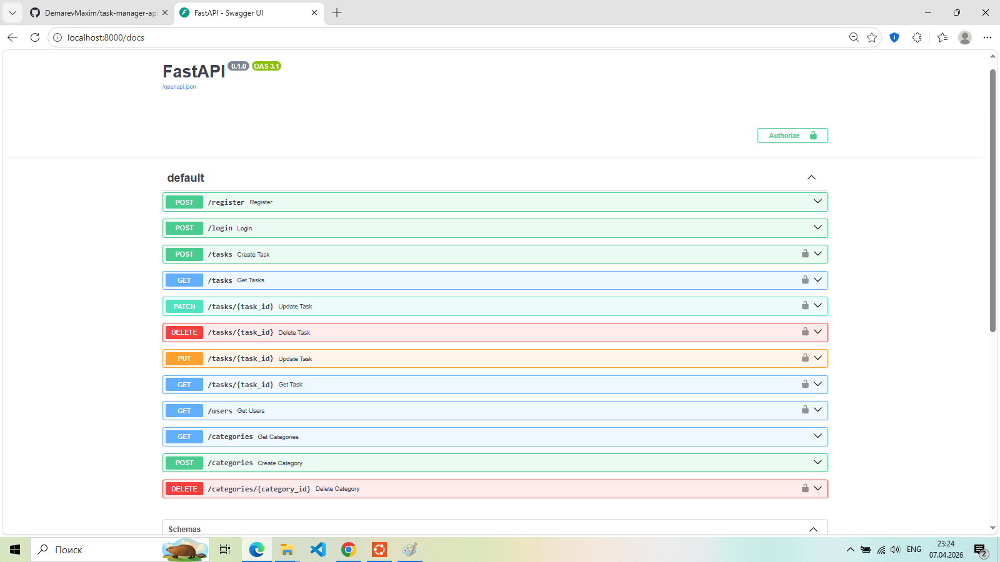

# 🚀 Task Manager API

REST API для управления задачами с авторизацией пользователей, категориями и Docker-развёртыванием.

---

# 📌 Возможности

- Регистрация пользователей  
- Авторизация (JWT токены)  
- Роли пользователей (admin / user)  
- Создание категорий  
- Создание задач  
- Обновление задач  
- Связь задач с пользователями и категориями  
- Docker-контейнеризация  
- PostgreSQL база данных  
- Swagger документация API  

---

# 🛠 Технологии

- Python 3.11  
- FastAPI  
- SQLAlchemy  
- PostgreSQL  
- Docker  
- JWT Authentication  
- Pydantic  

## 📸 API Preview

---

# ⚙️ Установка и запуск

## Клонировать репозиторий

git clone https://github.com/DemarevMaxim/task-manager-api.git

cd task-manager-api

## Запуск через Docker

docker compose up --build  

После запуска открой:

http://localhost:8000/docs  

---

# 🔐 Авторизация

POST /register

{
 "username": "admin",
 "password": "123",
 "role": "admin"
}

POST /login

{
 "username": "admin",
 "password": "123"
}

---

# 📂 Основные эндпоинты

POST /register — регистрация  
POST /login — авторизация  

POST /categories — создать категорию  
GET /categories — получить список  

POST /tasks — создать задачу  
PATCH /tasks/{task_id} — обновить задачу  

---

# 🎯 Цель проекта

Учебный backend-проект для практики FastAPI, JWT и Docker.

---

# 👨‍💻 Автор

Максим Демарев  
GitHub: https://github.com/DemarevMaxim

---

# 📂 Структура проекта

task-manager-api/
├── alembic/
│   ├── versions/          # Миграции базы данных
│   └── alembic.ini        # Конфигурация Alembic
│
├── app/
│   ├── routers/           # Роутеры API
│   │   ├── users.py
│   │   ├── tasks.py
│   │   └── categories.py
│   │
│   ├── models.py          # SQLAlchemy модели
│   ├── schemas.py         # Pydantic схемы
│   ├── database.py        # Подключение к БД
│   ├── auth.py            # JWT авторизация
│   ├── crud.py            # CRUD логика
│   └── main.py            # Точка входа FastAPI
│
├── Dockerfile             # Docker образ
├── docker-compose.yaml    # Docker сервисы
├── requirements.txt       # Зависимости Python
├── .env.example           # Пример переменных окружения
├── .gitignore             # Игнорируемые файлы
├── swagger-task-manager.png # Скрин Swagger UI
└── README.md              # Документация проекта
